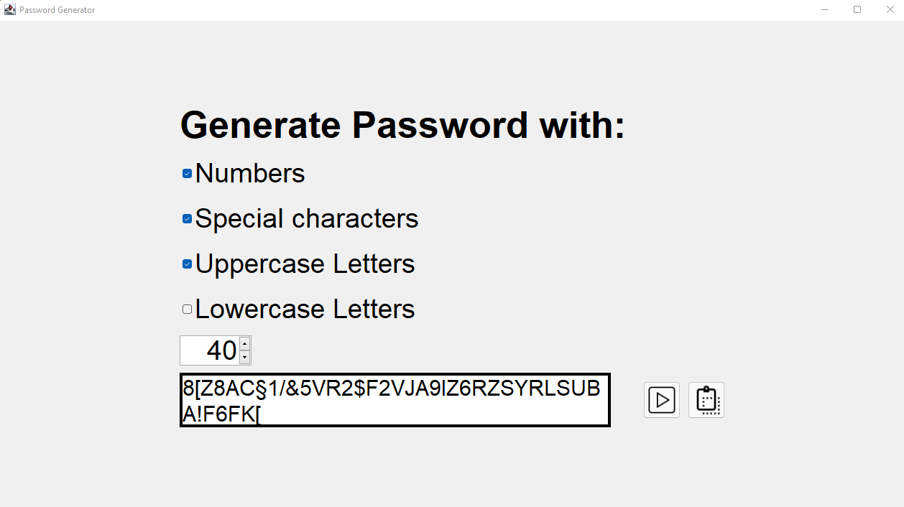
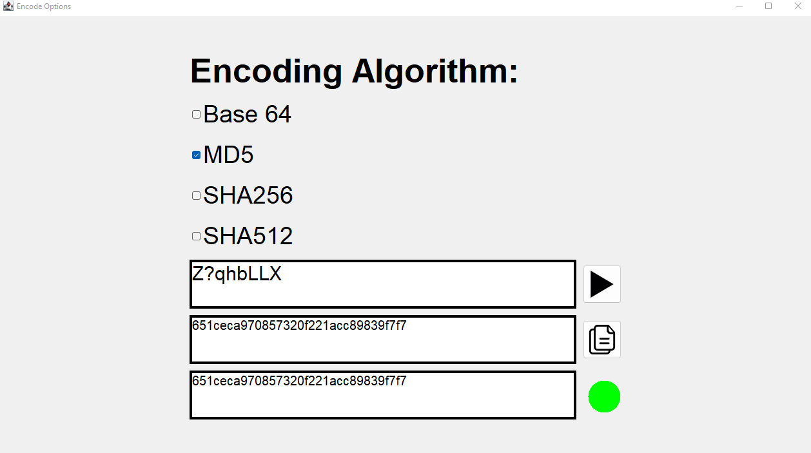

# Passwort Generator

Ein Passwort Generator, bei dem man die Optionen für die "Passwort-Generation" auswählen kann. Dabei können folgende Symbole bei der Passwortgeneration berücksichtigt werden:

- [x] Zahlen
- [x] Spezialcharaktere
- [x] Großbuchstaben
- [x] Kleinbuchstaben



## Encoding/Encryption Tab
Der Passwort Generator hat einen "Encoding(/Encryption) Button" dazu bekommen. Darüber kann man das Passwort über verschiedene Algorithmen 
verschlüsseln. Der Base64 Algorithmus lässt sich ohne Probleme wieder entschlüsseln, die anderen Algorithmen sind alles [Hashfunktionen](https://de.wikipedia.org/wiki/Kryptographische_Hashfunktion),
d.h. sie erstellen ein Hash aus einem Eingabewert, welcher sich praktisch nicht rekonstruieren lässt.
Der "Encoding(/Encryption) Tab" hat außerdem eine Vergleichsfunktion, da decoden/decrypten bei gehashten Passwörtern nicht
funktioniert. Um trotzdem herausfinden zu können, was das Passwort mal "ursprünglich" war, vergleicht man zwei gehashte Passwörter,
da man jedes Wort bzw. Passwort einfach hashen kann, um herauszufinden was das gehashte Passwort, gegen welches man vergleicht, ursprünglich mal war.



1. Clone this repository
```
git clone https://github.com/github-gabriel/password-generator.git
```

2. Navigate into the project directory
```
cd .\password-generator\
```

3. Execute the .jar
```
java -jar .\PasswordGenerator.jar
```
