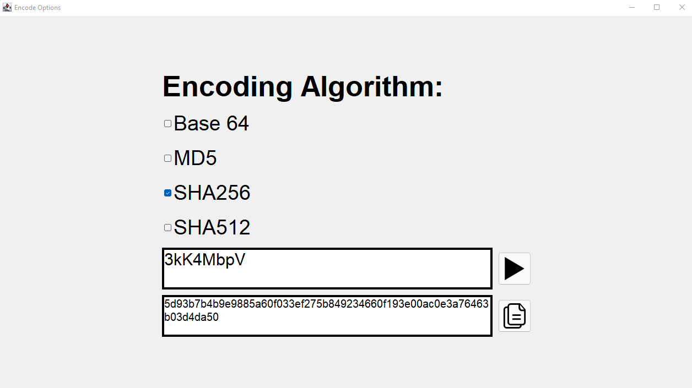

# Passwort Generator

Ein Passwort Generator, bei dem man die Optionen für die "Passwort-Generation" auswählen kann. Das Interface sieht wie folgt aus: 

Möglicherweise werde ich den Passwortgenerator noch überarbeiten und zusätzliche Features hinzufügen.
## Update
Der Passwort Generator hat einen "Encoding(/Encryption) Button" dazu bekommen. Darüber kann man das Passwort über verschiedene Algorithmen 
verschlüsseln. Der Base64 Algorithmus lässt sich ohne Probleme wieder entschlüsseln, die anderen Algorithmen sind alles [Hashfunktionen](https://de.wikipedia.org/wiki/Kryptographische_Hashfunktion), d.h. sie erstellen ein Hash aus einem Eingabewert, welcher sich praktisch nicht rekonstruieren lässt, außer man bruteforced so lange, bis man den selben Hash bekommt, was aber sehr aufwending und zeitintensiv ist.

## Update 2
Der "Encoding(/Encryption) Tab" hat jetzt eine neue Vergleichsfunktion, da decoden/decrypten bei gehashten Passwörtern nicht
funktioniert. Um trotzdem herausfinden zu können, was das Passwort mal "ursprünglich" war, vergleicht man zwei gehashte Passwörter, da man jedes Wort bzw. Passwort einfach hashen kann, um herauszufinden was das gehashte Passwort, gegen welches man vergleicht, ursprünglich mal war.

